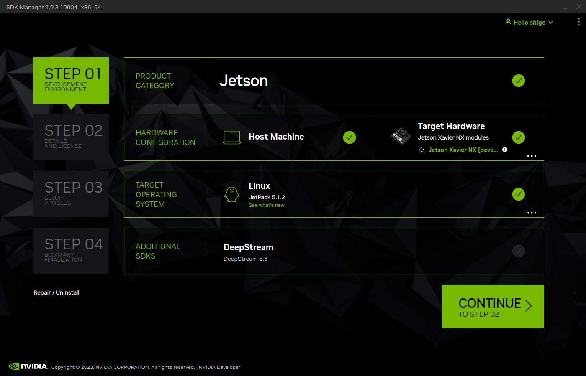
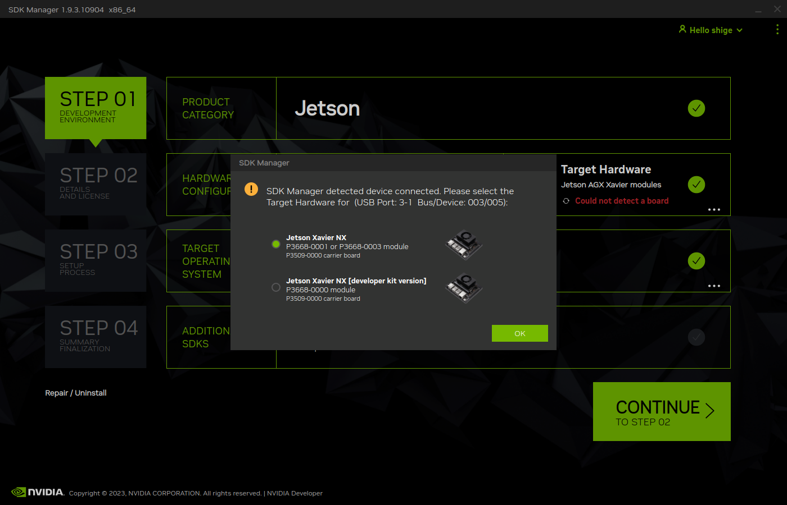
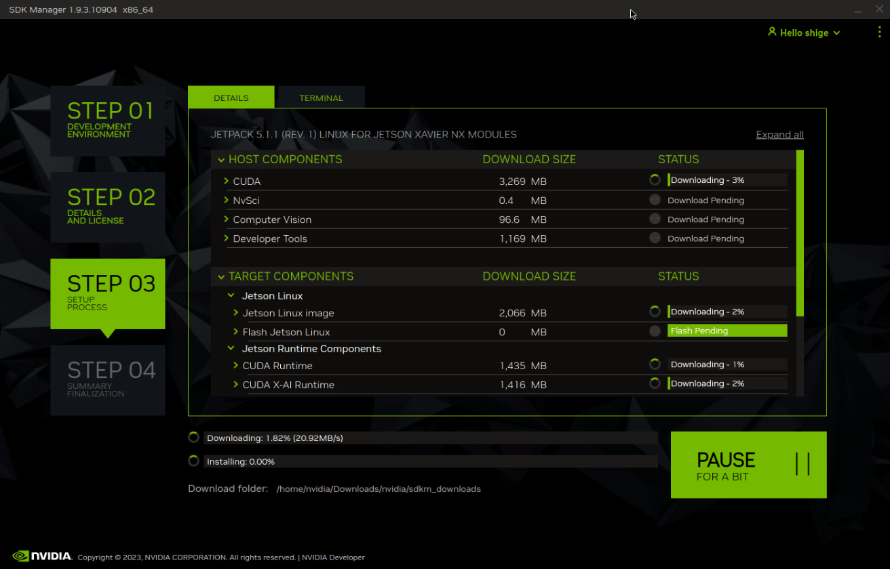

<!--
# sdkmanagerでjetpackのインストール

## comming soon ... 
-->

# Jetson マニュアル

このマニュアルでは、Jetsonデバイスをセットアップし、クローンするための手順を説明します。

## 1. NVIDIA SDK ManagerでJetpackのインストール

### 1.1 NVIDIA SDK Manageとは
NVIDIA Jetsonプラットフォーム、NVIDIA DRIVEプラットフォームの開発環境をセットアップするツール。

### 1.2 NVIDIA SDK Managerの用意
ここでは、NVIDIA SDK Managerを用意する方法を2つ紹介します。

- nativeのNVIDIA SDK Managerを使用する
- Nvidia-sdkmanager-docker-guiを使用する

=== "nativeのNVIDIA SDK Manager"
    NVIDIA SDK Managerをaptでインストールします。

    [NVIDIA公式サイト](https://developer.download.nvidia.com/sdkmanager/redirects/sdkmanager-deb.html)より、debファイルをダウンロード

    ```bash
    sudo dpkg -i ./sdkmanager_1.9.3-10904_amd64.deb
    ```

=== "Nvidia-sdkmanager-docker"
    GitHubにて公開されている、以下のパッケージを使用します。詳しいやり方はこのリポジトリの[README.md](https://github.com/IkuoShige/Nvidia-sdkmanager-docker-gui/blob/main/README.md)を参照してください。
    <iframe class="hatenablogcard" style="width:100%;height:155px;max-width:680px;" title="%text%" src="https://hatenablog-parts.com/embed?url=https://github.com/IkuoShige/Nvidia-sdkmanager-docker-gui" width="300" height="150" frameborder="0" scrolling="no"> </iframe> 

    このリポジトリのclone
    ```bash
    $ git clone https://github.com/IkuoShige/Nvidia-sdkmanager-docker-gui.git
    $ cd Nvidia-sdkmanager-docker-gui/
    ```

    ダウンロードするにはNvidiaのアカウントにログインする必要があるため、下記のNvidiaのリンクからログインして直接ダウンロードしてください:

    - [https://developer.nvidia.com/sdk-manager](https://developer.nvidia.com/sdk-manager)


    ダウンロードしたファイルからDockerイメージを作成
    ```bash
    $ docker load -i ~/Downloads/sdkmanager-1.9.3.10904-Ubuntu_20.04_docker.tar.gz
    ```

    Dockerイメージを元にコンテナをbuild:
    ```bash
    $ ./build_docker_images.sh --ubuntu-version 20.04 --docker-version 1.9.3.10904
    ```

### 1.3 SDK Managerを用いたJetpackのインストール

NVIDIA SDK Managerの起動

=== "nativeのNVIDIA SDK Manager"
    ```bash
    $ sdkmanager
    ```

=== "Nvidia-sdkmanager-docker"
    ```bash
    $ ./launch_container.sh --ubuntu-version 20.04 --jetpack-home ./jetpack_home
    $ sdkmanager
    ```


<!--
<figure markdown>
  { width="300" align="center" }
  <figcaption>Image caption</figcaption>
</figurer>
-->

<!--
<a href="../images/sdkmanager_login.png" data-lightbox="login">Image #1</a>
-->










[これ](https://docs.nvidia.com/sdk-manager/install-with-sdkm-jetson/index.html)みて書く or 録画した映像から画像を取得して自分で書くか

## 2. Jetsonのセットアップ

1. JetPackのダウンロードが完了するまで待ちます。
2. Jetsonが起動すると、設定したパスワードでログインします。
3. WiFiの設定を行います。
    - IPアドレスを固定します。
    - 有線または無線接続を選択します。
    - 設定を完了したらWiFiを再起動します。
4. ボード上のジャンパ線を外します。


