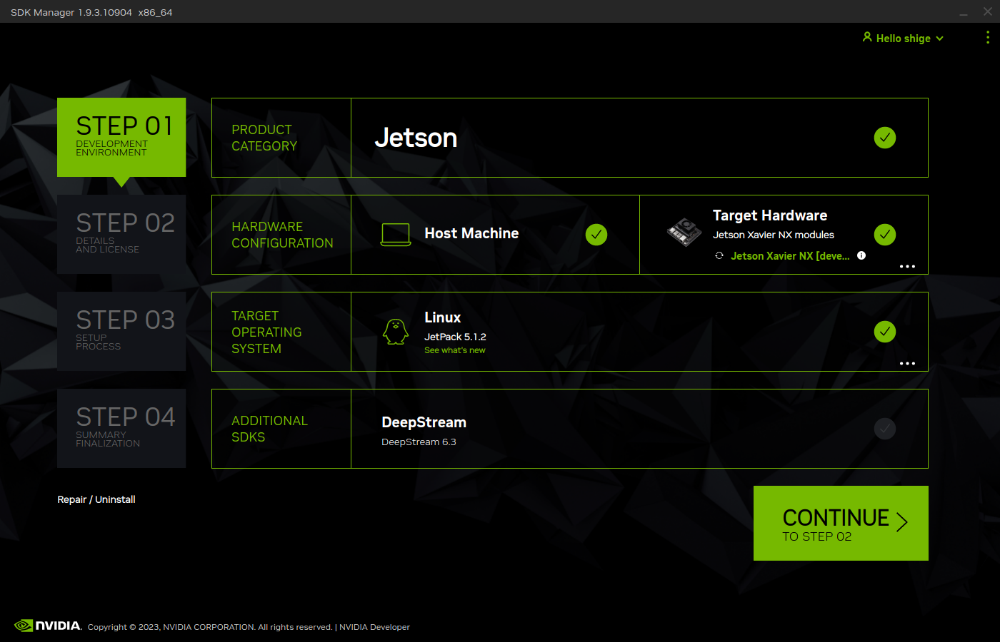

# Nvidia-sdkmanager-docker-gui

GitHubにて公開しています。

[](https://github.com/IkuoShige/Nvidia-sdkmanager-docker-gui)

<iframe class="hatenablogcard" style="width:100%;height:155px;max-width:680px;" title="%text%" src="https://hatenablog-parts.com/embed?url=https://github.com/IkuoShige/Nvidia-sdkmanager-docker-gui" width="300" height="150" frameborder="0" scrolling="no"> </iframe> 


<!--[]()-->



The English version of the README is available [here](https://github.com/IkuoShige/Nvidia-sdkmanager-docker-gui/blob/main/README_EN.md).

DockerでsdkmanagerをGUIで使うためのDockerfileとスクリプトファイルです。

## 動作環境
以下は、Nvidia-sdkmanager-docker-guiの動作環境およびテスト結果です。

- hostPC:
    - Ubuntu 22.04.3 LTS
- Jetpackのインストール
    - Jetpack 5.1.1
    - Jetpack 5.0.2
    - Jetpack 4.6.4
- クローンイメージの作成

## dockerの環境構築

### dockerのインストール・セットアップ
```bash
sudo apt install docker.io
sudo gpasswd -a $USER docker
sudo reboot
```

PC or dockerのデーモンを再起動すると  sudoなしでdockerコマンドを使用できるようになります。

## コンテナを起動

### 1. イメージの作成

このリポジトリをクローンして、`Nvidia-sdkmanager-docker-gui`ディレクトリに移動
```bash
git clone https://github.com/IkuoShige/Nvidia-sdkmanager-docker-gui.git
cd Nvidia-sdkmanager-docker-gui/
```

ダウンロードするにはNvidiaのアカウントにログインする必要があるため、下記のNvidiaのリンクからログインして直接ダウンロードしてください:

- [https://developer.nvidia.com/sdk-manager](https://developer.nvidia.com/sdk-manager)

ダウンロードしたファイルからDockerイメージを生成:
```bash
docker load -i ~/Downloads/sdkmanager-<version>-Ubuntu_<distribution>_docker.tar.gz
```

例:
```bash
docker load -i ~/Downloads/sdkmanager-1.9.3.10904-Ubuntu_20.04_docker.tar.gz
```

Dockerイメージを元にコンテナをbuild:
```shell
./build_docker_images.sh --ubuntu-version <distribution> --docker-version <sdkmanager-version>
```

例:
```shell
./build_docker_images.sh --ubuntu-version 20.04 --docker-version 1.9.3.10904
```

* 備考:
    * --ubuntu-version で -v と同様にubuntuのディストリビューションを設定
    * --docker-version でダウンロードしたsdkmanagerのversionを設定

### 2. コンテナ起動
```shell
./launch_container.sh --ubuntu-version <distribution> --jetpack-home <path/to/jetpack_home>
```
例:
```shell
./launch_container.sh --ubuntu-version 20.04 --jetpack-home ./jetpack_home
```

* 備考:
    * --ubuntu-version でubuntuのディストリビューションを設定可能
        * デフォルトでは`20.04`を指定
    * --jetpack-home でsdkmanagerによって作成されるnvidiaディレクトリの1つ上の階層を設定可能
        * デフォルトでは、`./jetpack_home`を指定

## sdkmanager (GUI) の実行

```bash
sdkmanager
```

初回起動時にはログイン画面が表示されます。

`LOGIN`ボタンを押すと、chromeが起動し、nvidiaアカウントのログインベージへ移動します。

メールアドレスとパスワードを入力し認証を行ってください。

<!--[]()-->


認証が完了すると、`TARGET HARDWARE`や`TARGET OPERATING SYSTEM`を選択できるようになります。

## sdkmanager (CLI) の実行

Jetpack 5.1.1をJetson Xavier NXにインストールする場合
```bash
sdkmanager --cli install --logintype devzone --product Jetson --version 5.1.1 --targetos Linux --host --target JETSON_XAVIER_NX_TARGETS --flash all --additionalsdk 'DeepStream 6.2'
```
